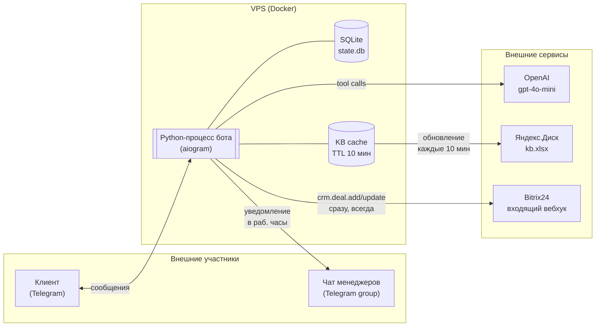
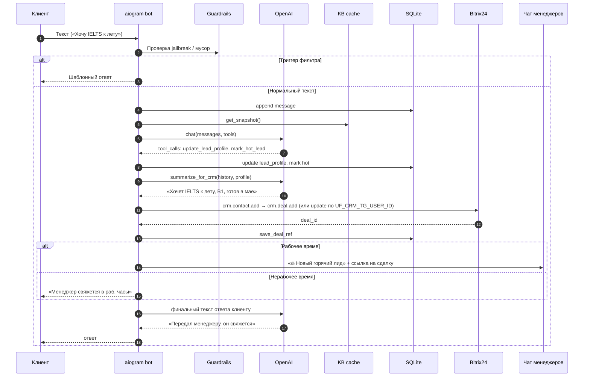

# Архитектура (Deliverable #4)

## Компоненты и потоки

## Поток обработки сообщения

## Стек одной фразой

`Python 3.11 · aiogram 3 · OpenAI gpt-4o-mini (function calling) · Яндекс.Диск REST → openpyxl · SQLite (aiosqlite) · Bitrix24 webhook · Docker · GitHub`

## Ключевые архитектурные решения

| Решение | Альтернатива | Почему так |
|---|---|---|
| Function calling, не отдельный классификатор интентов | Промпт-классификатор → промпт-ответчик | Меньше промптов = меньше дрейфа; модель сама решает, когда дернуть KB |
| Полная xlsx-таблица в кэше памяти | Векторная БД / RAG | 5-8 курсов умещается в один tool-ответ; векторка = лишняя зависимость |
| SQLite на volume | Redis / Postgres | NFR-13 запрещает лишние сервисы; одного процесса хватает |
| Один контейнер | Микросервисы | Учебный проект, ~200 сообщений/мин потолок; нет смысла дробить |
| Дедуп сделок через `UF_CRM_TG_USER_ID` + локальная таблица `deals` | Только Bitrix-поиск | Дешевле и быстрее: при повторном заходе клиента сразу знаем deal_id |
| Дедуп уведомлений в чат | Без дедупа | FR-9.4: не засоряем чат менеджеров одинаковыми сигналами по одному клиенту |
