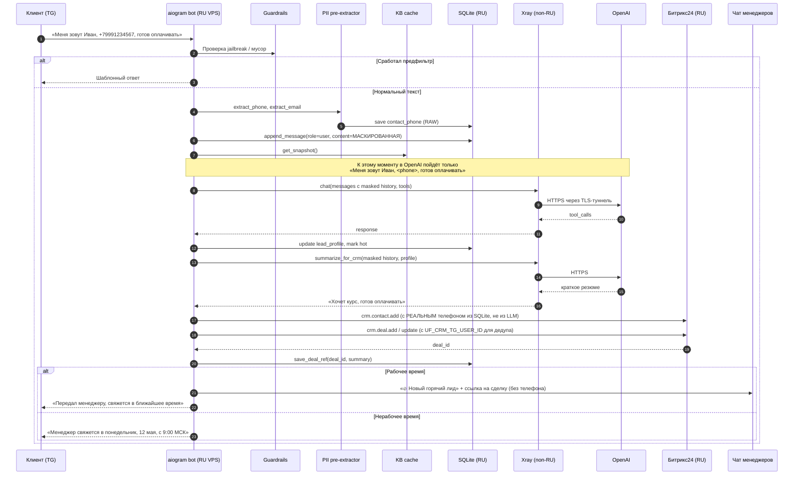

# Архитектура (Deliverable #4)

## Компоненты и потоки

```mermaid
flowchart LR
    subgraph User["Внешние участники"]
        client["Клиент<br/>(Telegram)"]
        managers["Чат менеджеров<br/>(Telegram group)"]
    end

    subgraph RU["VPS №1 — РФ (бот + ПДн)"]
        direction TB
        bot[["Python-процесс бота<br/>(aiogram 3)"]]
        pii["PII pre-extractor<br/>(regex телефон/email)"]
        mask["PII masker<br/>(history + outbound)"]
        sqlite[("SQLite state.db<br/>история (маскированная)<br/>профили, дедуп сделок<br/>contact_phone (RAW, РФ)")]
        cache[(KB cache<br/>TTL 10 мин)]
        bot --- pii
        bot --- mask
        bot --- sqlite
        bot --- cache
    end

    subgraph NONRU["VPS №2 — non-RU (только туннель)"]
        xray["Xray-сайдкар<br/>SOCKS5 → VLESS+Reality"]
    end

    subgraph RuCloud["Внешние сервисы (РФ)"]
        ydisk["Яндекс.Диск<br/>kb.xlsx"]
        bitrix["Битрикс24<br/>входящий вебхук<br/>(хранение полных ПДн)"]
    end

    subgraph IntCloud["Внешние сервисы (за рубежом)"]
        tg["Telegram Bot API<br/>(149.154.x.x)"]
        openai["OpenAI<br/>gpt-4o-mini"]
    end

    client <-->|сообщения| tg
    tg <-->|polling| bot

    bot -->|"уведомление<br/>(имя+TG, без телефона)"| managers
    bot -->|crm.deal.add/update<br/>с ПДн в открытом виде| bitrix
    cache -->|обновление KB<br/>(calamine + openpyxl fallback)| ydisk

    mask -->|маскированный текст:<br/>имена, телефоны, email<br/>заменены на токены| xray
    xray -->|TLS-туннель<br/>через non-RU выход| openai

    style RU fill:#e8f5e9,stroke:#43a047
    style NONRU fill:#fff3e0,stroke:#fb8c00
    style RuCloud fill:#e3f2fd,stroke:#1976d2
    style IntCloud fill:#fce4ec,stroke:#d81b60
```

### Что важно на схеме

- **VPS №1 (РФ)** — основной сервер. Здесь живёт бот, его SQLite (со всеми ПДн), кэш базы знаний. ПДн (телефоны, email, имя клиента) хранятся **только тут** и в Битрикс24 — оба ресурса в России.
- **VPS №2 (не РФ)** — отдельный сервер с **Xray** в режиме VLESS+Reality. Используется как **сетевой туннель** для запросов в OpenAI (которая блокирует RU-IP по странам). Никаких данных в самом туннеле не хранится; через него проходит **уже маскированный** трафик.
- **PII pre-extractor + masker** на VPS №1 — телефон/email вытаскиваются из входящего сообщения **до** того, как оно попадёт в OpenAI. Реальные значения сохраняются в SQLite (РФ) и в Битрикс24 (РФ); в OpenAI уходит текст с подстановками `<phone>`, `<email>`, `<имя>`.
- **Telegram, Битрикс24, Я.Диск** — бот ходит к ним напрямую с VPS №1. Туннель через VPS №2 нужен **только для OpenAI** (за счёт routing-правил в xray-config.json).

## Поток обработки сообщения



### Ключевые моменты потока

- **Шаг 4-5**: телефон извлекается **локально** на RU-сервере регулярным выражением и сразу сохраняется в SQLite. В сообщении, которое пойдёт дальше, его уже нет.
- **Шаги 8-15**: всё общение с OpenAI идёт через Xray-туннель (VPS №2). LLM получает обезличенный диалог и не знает реальных имён/номеров клиента.
- **Шаг 16-17**: Битрикс24 получает **полные данные** (включая реальный телефон) — потому что менеджеру звонить надо. Битрикс в РФ, ПДн не пересекают границу.
- **Шаг 20**: уведомление в чат менеджеров не содержит телефон — только имя/username + ссылку на сделку.
- **Шаг 22**: формулировка ответа клиенту в нерабочее время цитирует точный ближайший рабочий слот из календарного блока (LLM не вычисляет даты сама).

## Стек одной фразой

`Python 3.11 · aiogram 3 · OpenAI gpt-4o-mini (function calling, через xray-туннель) · Яндекс.Диск REST → calamine (Rust) + openpyxl fallback · SQLite (aiosqlite) · Битрикс24 webhook · Xray VLESS+Reality на non-RU VPS · Docker Compose · GitHub Actions CI/CD`

## Ключевые архитектурные решения

| Решение | Альтернатива | Почему так |
|---|---|---|
| **Два VPS: РФ + не-РФ** | Один VPS в РФ | OpenAI блокирует RU-IP по странам; non-RU VPS = только сетевой туннель, ПДн на нём не хранятся |
| **Pre-extraction + маскирование ПДн** | Слать всё в OpenAI как есть | 152-ФЗ: трансгран ПДн в США требует письменного согласия + уведомления РКН. Маскируем — закрываем большую часть риска |
| **Xray VLESS+Reality, а не open VPN/SOCKS** | WireGuard / OpenVPN / открытый SOCKS | Reality маскирует трафик под «нормальный TLS к microsoft.com/aws.amazon.com» — устойчиво к DPI и блокировкам провайдеров. Туннель только для OpenAI (через routing rules), остальное идёт напрямую |
| **calamine (Rust) как основной парсер xlsx, openpyxl как fallback** | Только openpyxl | calamine терпимее к xlsx, экспортированным Я.Документами / онлайн-редакторами (битый styles.xml) |
| **Function calling, не отдельный классификатор интентов** | Промпт-классификатор → промпт-ответчик | Меньше промптов = меньше дрейфа; модель сама решает, когда дёрнуть KB |
| **Полная xlsx-таблица в кэше памяти** | Векторная БД / RAG | 6-8 курсов умещается в один tool-ответ; векторка = лишняя зависимость |
| **SQLite на volume** | Redis / Postgres | NFR-13 запрещает лишние сервисы; одного процесса хватает |
| **Один контейнер бота + сайдкар xray** | Микросервисы | Учебный проект, ~200 сообщений/мин потолок; xray вынесен в сайдкар, чтобы можно было выключать/включать без перепаковки бота |
| **Дедуп сделок через `UF_CRM_TG_USER_ID` + локальная таблица `deals`** | Только Bitrix-поиск | Дешевле и быстрее: при повторном заходе клиента сразу знаем deal_id |
| **Дедуп уведомлений в чат менеджеров (час)** | Без дедупа | FR-9.4: не засоряем чат одинаковыми сигналами по одному клиенту |
| **Phone guard: CRM не создаётся без явного телефона** | Падать на tg_username | Менеджеры звонят, а не пишут в TG; tg_username может быть закрыт настройками приватности |
| **Календарный блок в системном промпте** | LLM считает даты сама | gpt-4o-mini плохо считает «сегодня + N дней = ?»; готовый блок снимает ~80% ошибок типа «понедельник 12 мая» (а это 11-е) |
